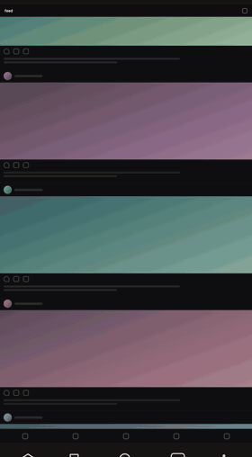
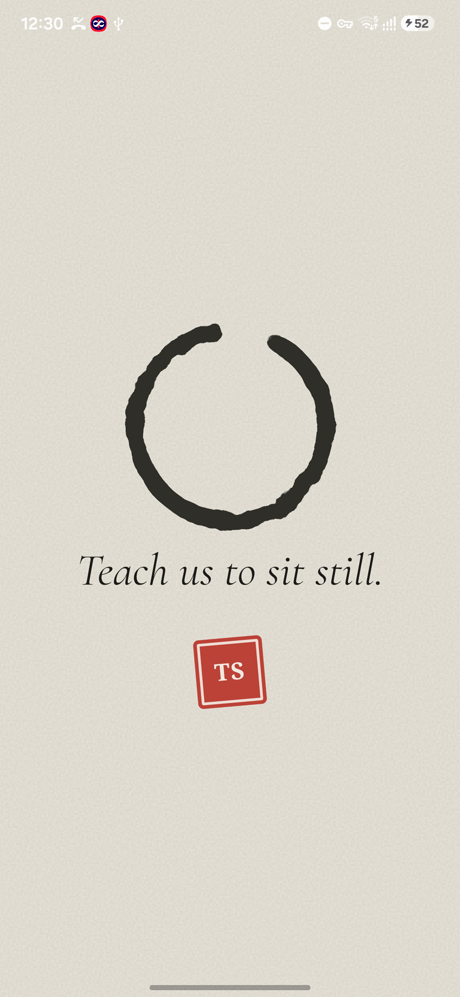
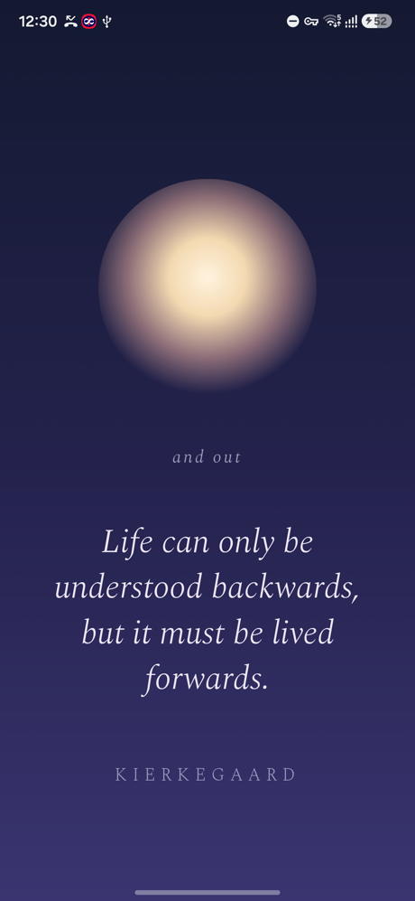
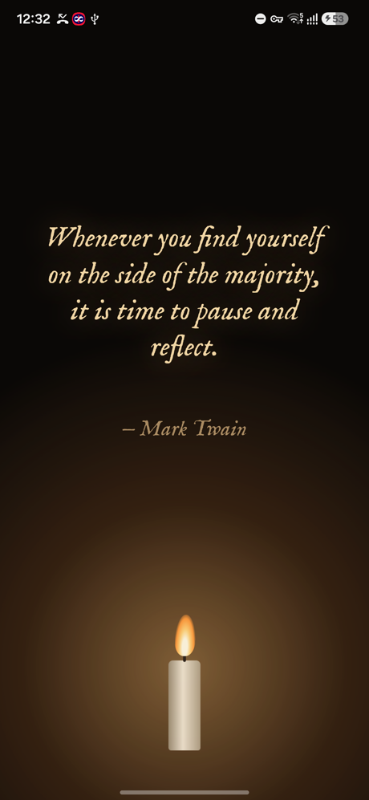
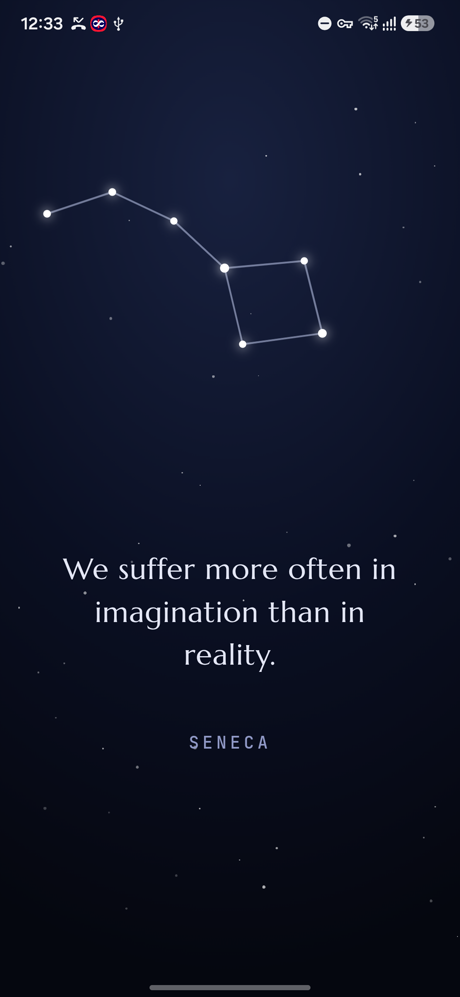
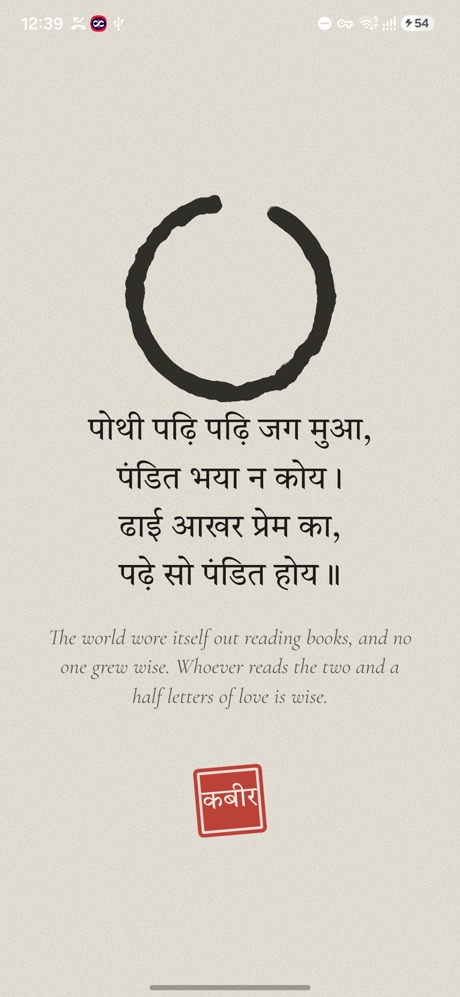

<div align="center">


# Viraam

**विराम · a pause.** A quiet line takes over your screen when scrolling turns into
autopilot, then fades on its own. No accounts, no tracking, and no internet permission at all.




<sub>Real frames from the app. The feed behind it is a stand-in, not anyone's actual timeline.</sub>

</div>

## What it does

You open Reels to look at one thing and twenty minutes disappear. Viraam notices,
waits for the gap between two reels, quietly mutes the sound, and fills the screen
with one line worth reading. A few seconds later it fades by itself and you carry on.

There is nothing to tap and nothing to dismiss. It asks nothing of you. The only
thing you *can* do is press and hold to keep a line you liked.

<div align="center">




</div>

## How it decides when

Not on a timer. A hidden "drift" level fills while you scroll feed apps, faster when
you're swiping quickly, and drains when you chat, use maps, or put the phone down.
When it passes a tipping point — set a little differently every time, so you can't
learn to expect it — the next swipe is the moment.

It holds off completely when you're on a call, when the phone is sideways (you're
probably watching something), when the screen is locked, and while you're typing.
It respects quiet hours, a daily limit, and at least twenty minutes between pauses.

You choose which apps count. Only apps actually installed on your phone are listed.

## Seven looks

| | |
|---|---|
| **Ink** | Rice paper, a brush circle drawn in one stroke, a couplet written line by line, a red seal. |
| **Breath** | The screen dims and a warm light breathes, 4 seconds in and 6 out. Words arrive one at a time. |
| **Frost** | The glass fogs over with your feed blurred behind it, a note appears in handwriting, then drops run down and it clears. |
| **Ripple** | A drop falls into still water, rings spread, and the line surfaces with its reflection beneath. |
| **Candle** | Everything goes dark and one flame lights the words. When it's time, the flame goes out and smoke curls up. |
| **Drift** | A single leaf falls, swaying, and the lines appear in its wake. |
| **Stars** | A night sky, stars lighting one by one into a constellation, and dawn washing them away at the end. |

Each has its own quiet sound: a singing bowl, soft wind, real rain, a water drop,
a wick crackling, a breeze, glass chimes. Viraam rotates the looks, never shows the
same one twice in a row, and leans towards Candle and Stars after dark.

## The words

100 lines to start with, mostly in English: Marcus Aurelius, Seneca, Epictetus,
Lao Tzu, Zhuangzi, Bashō, Thoreau, Emerson, Whitman, Dickinson, Blake, Wordsworth,
Pascal, Tolstoy, Kierkegaard, Van Gogh, Oscar Wilde, Mark Twain, Chesterton.

Pick the kinds you want — poetry, stoic, zen and tao, nature, reflection, wit,
scripture, bhakti and sufi — and turn off the ones you don't. Add your own lines
as well: a reminder to yourself, something a friend once said.

Every quote is old enough to be out of copyright, and nothing is pushed at you:
if you only want wit and nature, that's all you'll ever see.



**Other languages, if you want them.** Hindi, Sanskrit, Bengali, Punjabi and Tamil
are all switched off by default. Turn one on and you can set how much of your mix
it takes, with the English meaning underneath. Each script gets proper lettering
rather than a fallback font — the example here is a Kabir couplet in Ink.

<br clear="right">

## What it can and cannot see

* It uses Android's **Accessibility** service with screen reading switched **off**.
  It receives the name of the app in front and the fact that a scroll happened. Nothing else.
* It has **no internet permission**, so it has no way to send anything anywhere.
* No analytics, no accounts, no third-party code of any kind.
* Automatic Android backups are off, so your kept lines stay on your phone.

Details in [PRIVACY.md](PRIVACY.md).

## Install

**The easy way — [Obtainium](https://github.com/ImranR98/Obtainium)**
Install Obtainium, tap Add App, paste this repository's URL. It installs Viraam and
keeps it updated.

**Downloading the file yourself**
Grab the `.apk` from [Releases](../../releases) and open it.

> **If Android says "App blocked to protect your device"** — that's Play Protect
> refusing apps that use Accessibility when they arrive through a browser. It isn't
> about this app in particular. Either install through Obtainium above, or open
> Play Store → your picture → Play Protect → ⚙ → turn off "Scan apps with Play
> Protect" for a minute while you install, then switch it back on.

**Then, once:** open Viraam, go through the three setup screens, and switch it on
where Android asks. On Samsung it's under Installed apps. Android shows a stern
warning about Accessibility — that warning is the same for every app using this
permission, and what Viraam actually receives is listed above.

## Build it yourself

```bash
git clone https://github.com/golgames1/viraam
cd viraam
./gradlew assembleDebug      # or: gradle assembleDebug, with Gradle 8.14+
```

No API keys, no accounts, no hidden steps. Needs JDK 17+ and the Android SDK
(platform 36). The result is in `app/build/outputs/apk/debug/`.

The looks are plain HTML, CSS and JavaScript in
[`app/src/main/assets`](app/src/main/assets) — `overlay.html` builds them,
`looks.css` styles them, `sound.js` makes every sound from scratch except the rain,
and `quotes.js` holds the library and the rules for choosing. You can change how a
look moves or sounds without touching any Android code.

The Android side is five small Kotlin files: the timing brain
(`ViraamService.kt`), the window a look lives in (`Overlay.kt`), the settings
screen (`MainActivity.kt`), the foreground service that lets it draw and play sound
(`PauseService.kt`), and the settings store (`Prefs.kt`).

## Honestly

This app was **vibe-coded by a non-coder**, with heavy help from an AI assistant.
Every look, sound and decision was argued over and tested on a real phone, and the
security of it was reviewed before release — but it has been used by one person on
one Samsung phone, so expect rough edges on other devices. Tell me what breaks.

## Feedback

[Issues](../../issues) for bugs and ideas, [Discussions](../../discussions) for
everything else. Lines you think belong in the library are very welcome, as long as
they're out of copyright.

## Credits and licence

Code: MIT — see [LICENSE](LICENSE). Borrowed work, all credited in [NOTICE](NOTICE):

* Rain: *"Sound of light rainfall"* by **Mijesty**, Wikimedia Commons, CC BY-SA 4.0
* Lettering: Google Fonts, SIL Open Font License
* Quotes: public domain; English renderings written for this app
